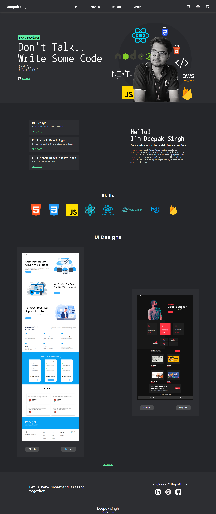

# Personal Portfolio Website

`Name:` Deepak Singh

This is my Personal Portfolio website designed fully with `HTML` and `CSS`. The following website contains:

 - Navbar
 - Header
 - About me Section
 - Projects Section
 - Contact Section
 - Footer

 # Learning Outcomes
  
  - Structuring `text` and `image` content for the web using `HTML5`.
  - Semantic `markup` new to the `HTML standard`.
  - Styling a web page using `Cascading Style Sheets (CSS)`.
  - Learnt the `inline and block model` for basic layout.
  - Learnt the `Flexbox model` for advanced layout.
  - Learn the `Grid model` for advanced layout.
  - `Postioning` content with respect to `absolute, relative, fixed , sticky`.
  - Making the UI beautiful using CSS concepts.

# Languages Used:
 ### HTML and CSS
  
 

 # Landing Page Screenshot

 

 # Time Taken to complete
`7 hours`

# Deployed Landing Page Link

[Personal Portfolio Website](https://personal-portfolio-website-alpha.vercel.app/)
***